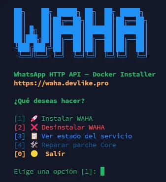

# 🚀 WAHA Docker Installer



Instalador interactivo para desplegar **WAHA (WhatsApp HTTP API)** con Docker de forma rápida, guiada y con credenciales generadas automáticamente.

El script principal es [`install-waha.sh`](./install-waha.sh) y permite instalar, revisar, reparar o desinstalar WAHA desde un menú en consola.

## ✨ Qué incluye

- 🐳 Instalación automática de **Docker** y **Docker Compose** si no están disponibles.
- 🔐 Generación automática de credenciales seguras.
- 📦 Soporte para **WAHA Core**, **WAHA Plus** y **WAHA ARM**.
- 🛠️ Parche local para WAHA Core/ARM que permite trabajar con sesiones con nombres distintos a `default`.
- 🌐 Configuración de puerto y exposición por `localhost` o por todas las IPs.
- 📋 Verificación de estado, contenedores, logs y health check.
- 🗑️ Desinstalación por niveles: Soft, Normal o Full.
- 💾 Archivo final con URLs, usuario, contraseñas y API key.

## 🖼️ Vista previa

### Interfaz de WAHA


### Pasos de instalación


### Datos finales generados


## ✅ Requisitos

- Servidor Linux compatible.
- Acceso a internet para descargar Docker e imágenes.
- Permisos de `root` o `sudo`.
- Bash disponible.

> Recomendado: ejecutar el instalador con `sudo` para evitar problemas de permisos.

## ⚡ Uso rápido

Descarga y ejecuta con Git:

```bash
git clone https://github.com/dotcom350/waha-docker-installer.git
cd waha-docker-installer
sudo bash install-waha.sh
```

Instalación remota todo en uno desde el archivo directo:

```bash
curl -L https://raw.githubusercontent.com/dotcom350/waha-docker-installer/refs/heads/main/install-waha.sh -o install-waha.sh
chmod +x install-waha.sh
sudo bash install-waha.sh
```

También puedes ejecutarlo sin `sudo`, pero algunos pasos podrían fallar si el usuario no tiene permisos suficientes:

```bash
bash install-waha.sh
```

## 📋 Menú principal

Al iniciar, el script muestra un menú interactivo:

```text
[1] 🚀 Instalar WAHA
[2] ❌ Desinstalar WAHA
[3] 📋 Ver estado del servicio
[4] 🛠️ Reparar parche Core
[0] 🟡 Salir
```

## 🚀 Instalación

Durante la instalación, el asistente realiza estos pasos:

1. 📁 Pide el directorio de instalación, por defecto `~/waha`.
2. 🐳 Verifica Docker y Docker Compose; si faltan, los instala.
3. 📦 Permite elegir la edición:
   - `WAHA Core`: gratis, recomendado y parcheado localmente. La primera opción de instalación permite que se corran varias sesiones de forma gratuita.
   - `WAHA Plus`: requiere API key de devlikeapro.
   - `WAHA ARM`: para servidores ARM como Raspberry Pi o Apple Silicon.
4. 🌐 Pide puerto de acceso, por defecto `3000`.
5. 🔒 Permite elegir exposición:
   - `127.0.0.1`: solo localhost, más seguro.
   - `0.0.0.0`: acceso externo directo.
6. 🔑 Genera credenciales:
   - Usuario y contraseña del dashboard.
   - API key para `X-Api-Key`.
   - Contraseña de Swagger.
7. 🧩 Crea `.env`, `docker-compose.yaml` y, si aplica, archivos del parche Core.
8. ▶️ Descarga/construye la imagen y levanta el contenedor.
9. 💾 Guarda todo en `waha-credentials.txt`.

## 🔗 URLs generadas

Al terminar, el script muestra y guarda:

- 🌐 Dashboard: `http://localhost:3000/dashboard`
- 📖 Swagger UI: `http://localhost:3000/docs`
- ❤️ Health Check: `http://localhost:3000/api/health`

Si eliges exponer WAHA públicamente, las URLs usarán la IP del servidor y el puerto seleccionado.

## 📁 Archivos generados

Dentro del directorio de instalación se crean:

```text
.env
docker-compose.yaml
waha-credentials.txt
Dockerfile.waha-core-patch   # solo Core/ARM
patch-waha-core.js           # solo Core/ARM
```

El archivo `waha-credentials.txt` queda con permisos `600` para proteger las credenciales.

## 📋 Ver estado

La opción **Ver estado del servicio** muestra:

- Contenedores activos con `docker compose ps`.
- Últimas 20 líneas de logs.
- Health check en `/api/health`.

También puedes hacerlo manualmente:

```bash
cd ~/waha
docker compose ps
docker compose logs -f
```

## 🛠️ Reparar parche Core

La opción **Reparar parche Core** reconstruye la imagen parcheada y reinicia el servicio.

Útil si:

- Se perdió `Dockerfile.waha-core-patch`.
- Se perdió `patch-waha-core.js`.
- El compose apunta a una imagen sin parche.
- Necesitas regenerar variables compatibles como `WAHA_API_KEY_PLAIN` o `WHATSAPP_API_KEY`.

## 🗑️ Desinstalación

El instalador ofrece tres niveles:

- 🟡 **Soft**: detiene y elimina contenedores, conserva archivos, volúmenes e imagen.
- 🟠 **Normal**: elimina contenedores y archivos de configuración.
- 🔴 **Full**: elimina contenedores, configuración, volúmenes de sesiones/media e imagen Docker.

> ⚠️ El modo **Full** elimina datos de sesiones de WhatsApp. Úsalo solo si quieres borrar todo.

## 🧰 Comandos útiles

```bash
cd ~/waha
docker compose logs -f
docker compose restart
docker compose down
docker compose up -d
```

Para actualizar WAHA Plus:

```bash
docker compose pull && docker compose up -d
```

Para reconstruir WAHA Core/ARM parcheado:

```bash
docker pull devlikeapro/waha
docker build -f Dockerfile.waha-core-patch --build-arg WAHA_BASE_IMAGE=devlikeapro/waha -t waha-core-session-patched:devlikeapro-waha .
docker compose up -d
```

## 🔐 Seguridad

- Usa `localhost` si vas a poner WAHA detrás de Nginx, Traefik o un túnel seguro.
- No compartas el archivo `waha-credentials.txt`.
- Protege el puerto si decides exponer WAHA en `0.0.0.0`.
- Guarda la API key en un gestor seguro.
- Revisa los logs si el health check no responde.

## 📌 Notas

- WAHA Plus requiere una API key válida y login en el registry correspondiente.
- WAHA Core y WAHA ARM usan una imagen local parcheada para mejorar el manejo de sesiones.
- El script está pensado para servidores Linux/VPS.
